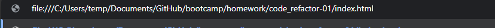

# Code Refactor

## Description

In this project we where to take this webpage it and give it correct semantic tags. We did this so it had better SEO and that it comforms to better html standards.

## Table Of Cotents

- [Installation And Usage](#installation)
- [Techniques](#techniques)
- [Git Pages](#pages)

## Installation
To get this up and runing simply download the repo. Extract and navigate your browser to the location of the index.html.

## Techniques
The techniques/stanrds used in this can be found at several very useful locations.
In doing this we were trying to conform to logical standards and semantic meanings.

[W3schools semantic resources](https://www.w3schools.com/html/html5_semantic_elements.asp)

[MSDN resources for semanttics](https://html.com/semantic-markup/)

[Mozzilla semantics resources.](https://developer.mozilla.org/en-US/docs/Web/HTML/Element)

## Pages

If you would like to view this live. Github has this great utility called Gitpages where you can host stuff.
If you click [here](https://hahkeye.github.io/homework-01-coderefactor/)